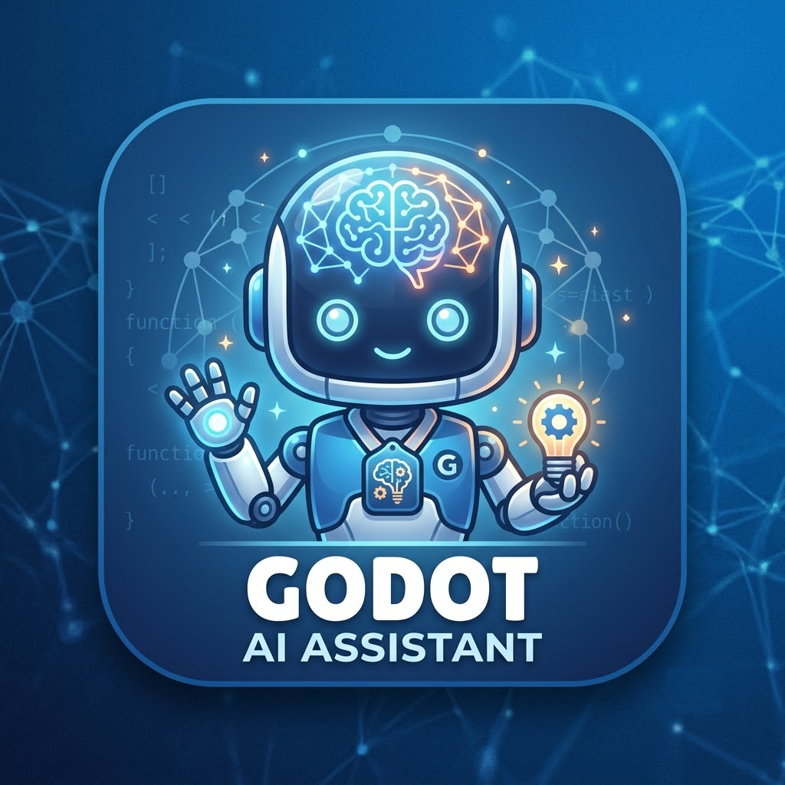
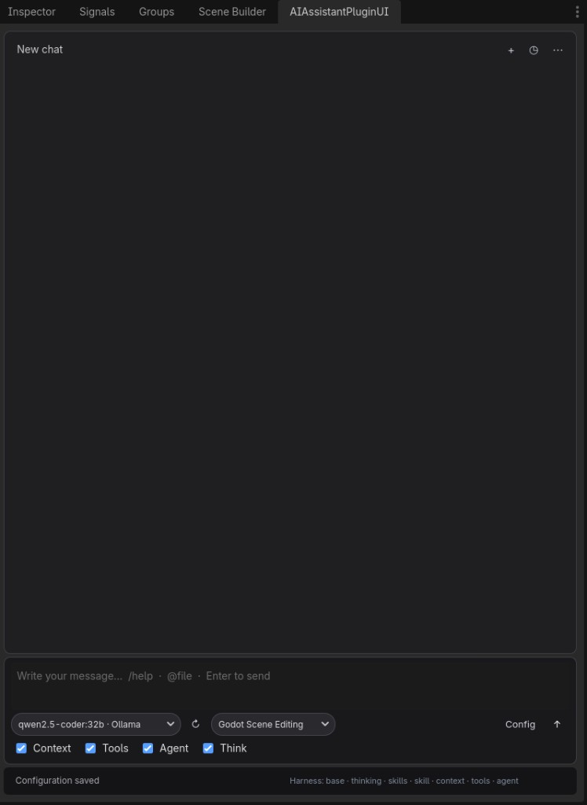
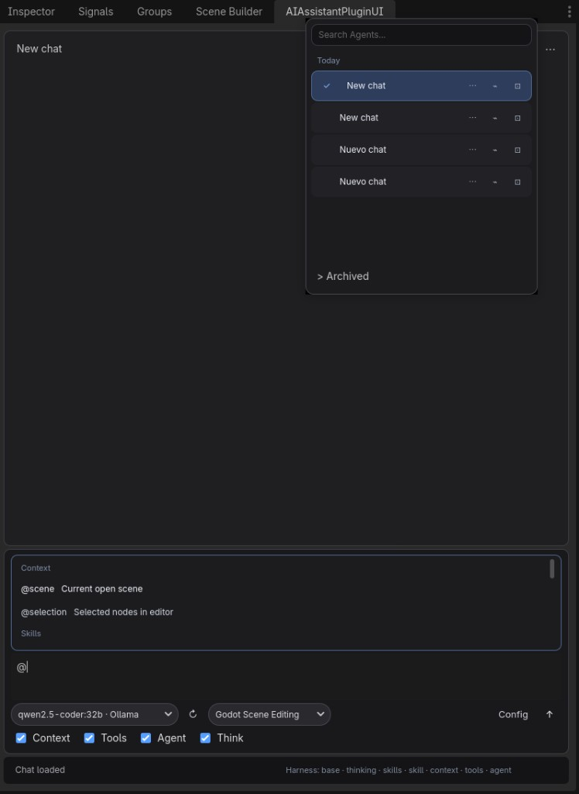
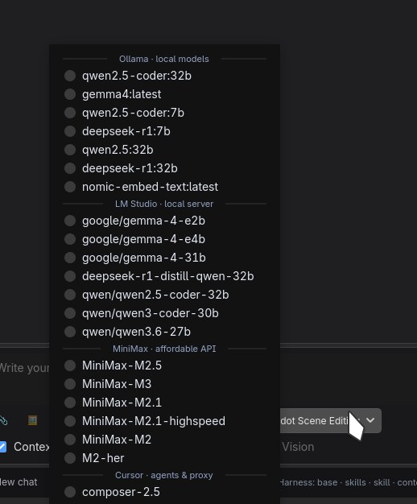

```
                           (((((((             (((((((
                        (((((((((((           (((((((((((
                        (((((((((((((       (((((((((((((
                        (((((((((((((((((((((((((((((((((
                        (((((((((((((((((((((((((((((((((
         (((((      (((((((((((((((((((((((((((((((((((((((((      (((((
       (((((((((((((((((((((((((((((((((((((((((((((((((((((((((((((((((((
     ((((((((((((((((((((((((((((((((((((((((((((((((((((((((((((((((((((((
    ((((((((((((((((((((((((((((((((((((((((((((((((((((((((((((((((((((((((
      (((((((((((((((((((((((((((((((((((((((((((((((((((((((((((((((((((((
        (((((((((((((((((((((((((((((((((((((((((((((((((((((((((((((((((
         (((((((((((@@@@@@@(((((((((((((((((((((((((((@@@@@@@(((((((((((
         (((((((((@@@@,,,,,@@@(((((((((((((((((((((@@@,,,,,@@@@(((((((((
         ((((((((@@@,,,,,,,,,@@(((((((@@@@@(((((((@@,,,,,,,,,@@@((((((((
         ((((((((@@@,,,,,,,,,@@(((((((@@@@@(((((((@@,,,,,,,,,@@@((((((((
         (((((((((@@@,,,,,,,@@((((((((@@@@@((((((((@@,,,,,,,@@@(((((((((
         ((((((((((((@@@@@@(((((((((((@@@@@(((((((((((@@@@@@((((((((((((
         (((((((((((((((((((((((((((((((((((((((((((((((((((((((((((((((
         (((((((((((((((((((((((((((((((((((((((((((((((((((((((((((((((
         @@@@@@@@@@@@@((((((((((((@@@@@@@@@@@@@((((((((((((@@@@@@@@@@@@@
         ((((((((( @@@(((((((((((@@(((((((((((@@(((((((((((@@@ (((((((((
         (((((((((( @@((((((((((@@@(((((((((((@@@((((((((((@@ ((((((((((
          (((((((((((@@@@@@@@@@@@@@(((((((((((@@@@@@@@@@@@@@(((((((((((
           (((((((((((((((((((((((((((((((((((((((((((((((((((((((((((
              (((((((((((((((((((((((((((((((((((((((((((((((((((((
                 (((((((((((((((((((((((((((((((((((((((((((((((
                        (((((((((((((((((((((((((((((((((
```

```
   ______      __                     ___    ____
  / ____/___  / /__  ____ ___        /   |  /  _/
 / / __/ __ \/ / _ \/ __ `__ \______/ /| |  / /  
/ /_/ / /_/ / /  __/ / / / / /_____/ ___ |_/ /   
\____/\____/_/\___/_/ /_/ /_/     /_/  |_/___/   
```

> **Golem-AI** — el golem de Godot con inteligencia artificial.


# Golem-AI

<p align="center">
  
</p>

**AI-powered editor assistant for Godot 4** — chat with local or cloud models, edit scenes, run editor tools, attach files and images, and manage agent sessions from the dock.

Created by **[sancheznotdev](https://github.com/sancheznot)** · MIT License

---

## Screenshots

**Editor dock** — chat, model/skills toolbar, context/agent toggles, and vision/thinking options.

<p align="center">
  
</p>

**Agent history & `@` context** — searchable sessions, multi-select, pin/archive, and autocomplete for scenes, files, and skills.

<p align="center">
  
</p>

**Models & providers** — one dropdown with local and cloud models grouped by provider (Ollama, LM Studio, MiniMax, Cursor, OpenRouter, Kimi, OpenAI, Anthropic, Gemini).

<p align="center">
  
</p>

---

## Features

### Chat & composer

- **Bubble UI** with collapsible thinking blocks, tool calls, tool results, and code blocks
- **Copy button** on assistant messages and collapsible code blocks
- **Attachments**: text files (`.gd`, `.tscn`, `.md`, …) and **images** (PNG, JPG, WebP, …)
- **`@` mentions** and **`/` commands** with autocomplete
- **Vision** and **Think** toggles — auto-enabled only when the selected model supports them (preferences persist between sessions)

### Providers & models

| Provider | Notes |
|----------|--------|
| **Ollama** | Local models |
| **LM Studio** | Local server; reads `capabilities.vision` from native API |
| **OpenRouter** | Many cloud models, pay-as-you-go |
| **Kimi** | Moonshot AI |
| **MiniMax** | M3 = visión + thinking; M2.x = solo texto + thinking (sin imágenes) |
| **OpenAI** | Cloud API |
| **Anthropic** | Cloud API |
| **Gemini** | Google API |
| **Cursor** | Local OpenAI-compatible proxy or cloud agents |

- Model dropdown grouped by **provider separators**
- **↻ Refresh** loads models from each enabled provider
- Capability detection (`model_capabilities.gd`) + provider metadata (LM Studio / OpenRouter) to avoid invalid vision/thinking options

#### MiniMax models (official API)

Source: [MiniMax models](https://platform.minimax.io/docs/guides/models-intro) · [Anthropic-compatible API](https://platform.minimax.io/docs/api-reference/text-anthropic-api)

| Model | Vision (images) | Thinking |
|-------|-----------------|----------|
| **MiniMax-M3** | Yes (image + video) | Yes (toggle `disabled` / `adaptive`) |
| MiniMax-M2.7 / highspeed | No | Yes (always on at API) |
| MiniMax-M2.5 / highspeed | No | Yes (always on at API) |
| MiniMax-M2.1 / highspeed | No | Yes (always on at API) |
| MiniMax-M2 | No | Yes (always on at API) |
| M2-her | No | No (dialogue / roleplay) |

Only **MiniMax-M3** accepts `image_url` / `video_url` in chat. All other MiniMax chat models are **text + tools only**.

### Agent & tools

- **Editor tools** — optional tool-calling loop in the Godot editor
- **Agent loop** — multi-step verify & fix with compact tool results (faster, less redundant inspection)
- **Skills system** — Markdown skills (`/skill`, dropdown, `@skill:id`)
- **Project context** — open scene, selection, `@file` mentions, configurable depth

### Session history

- **Search**, **pin**, **archive**, and **New Agent** (`Ctrl+N`; `Alt` replaces current session)
- **Multi-select** — checkboxes per chat, **Select all**, bulk **Archive** / **Restore** / **Delete**
- **Delete confirmation** — single chat or bulk; clears selection after archive/restore/delete
- More menu (⋮): clear messages, delete active chat, open config

### Localization

- **English / Spanish** UI (Config → UI language: `auto`, `en`, `es`)

---

## Requirements

- **Godot 4.2+** (tested on 4.6.x)
- At least one AI provider configured (e.g. [Ollama](https://ollama.com/) or [LM Studio](https://lmstudio.ai/) for local use)

## Installation

### Manual

1. Copy this folder into your project:

   ```
   your_project/addons/ai_assistant_plugin/
   ```

2. Open **Project → Project Settings → Plugins**
3. Enable **AI Assistant Plugin**
4. Open the **AI Assistant** dock tab in the editor

### From GitHub

```bash
git clone https://github.com/sancheznot/Godot-AI-Assistant.git addons/ai_assistant_plugin
```

Then enable the plugin in Project Settings.

## Quick start

1. Click **Config** in the dock toolbar
2. Enable a provider (e.g. Ollama or LM Studio) and set endpoint + model
3. Click **↻** to refresh the model list
4. Choose **Context**, **Tools**, **Agent**, **Think**, and **Vision** as needed (greyed-out toggles = model does not support that feature)
5. Type a message and press **Enter**

### Attachments

| Control | Action |
|---------|--------|
| **📎** | Attach a text file (content injected into context) |
| **🖼** | Attach an image (requires **Vision** on + vision-capable model) |

You can send attachments without text; the plugin uses a default analysis prompt.

### Composer shortcuts

| Input | Action |
|--------|--------|
| `@` | Attach context (scene, files, skills) |
| `/` | Commands (`/help`, `/clear`, `/history`, `/skill`, …) |
| `Enter` | Send message |
| `Shift+Enter` | New line |
| `Ctrl+N` | New agent (session) |
| `Alt+click` **+** | Replace current agent (clear messages) |

### History panel

| Control | Action |
|---------|--------|
| Checkbox on row | Select chat for bulk actions |
| **All** | Select / deselect visible chats |
| **Archive** / **Restore** | Bulk archive or unarchive selection |
| **Delete** | Bulk delete with confirmation |
| **⋯** / **🗑** | Per-chat menu or delete |

---

## Configuration

Copy the example config on first setup:

```
cp addons/ai_assistant_plugin/config/plugin_config.example.json \
   addons/ai_assistant_plugin/config/plugin_config.json
```

Settings (endpoints, models, toggles) are stored in `config/plugin_config.json`. **API keys are never written there.**

### API keys & secrets

| Storage | Path / variable | Notes |
|--------|------------------|--------|
| **Encrypted file** | `user://ai_assistant_plugin/secrets.enc` | Default. Keys from the Config UI are saved here via Godot's encrypted file API. |
| **Passphrase** | `GOLEM_AI_SECRETS_PASSPHRASE` | Optional. Custom passphrase for `secrets.enc`. Default: machine id (per device). |
| **Environment** | `GOLEM_AI_API_KEY_<PROVIDER>` | Optional override per provider, e.g. `GOLEM_AI_API_KEY_OPENAI`, `GOLEM_AI_API_KEY_MINIMAX`. Takes priority over the encrypted store. |

On first launch after updating, keys still present in an old `plugin_config.json` are **migrated automatically** to `secrets.enc` and removed from the JSON.

> **Do not commit API keys.** `plugin_config.json` is gitignored; use `plugin_config.example.json` as the template. If keys were ever pushed to git, **rotate them** in each provider's dashboard.

Key options in `plugin_config.json`:

- **Providers** — endpoints, API keys, default models
- **Context depth** — `basic` / `intermediate` / `full`
- **Agent loop** — multi-step verify & fix with editor tools
- **enable_vision** / **enable_thinking** — persisted preferences (respect model capabilities)
- **Skills path** — folder with `.md` skill files
- **UI language** — `auto`, `en`, `es`

Chat history is saved under `user://ai_assistant_plugin/chat_history.json`.

## Project structure

```
ai_assistant_plugin/
├── icon.png
├── docs/                      # AssetLib previews
│   ├── preview_dock.jpg
│   ├── preview_autocomplete.jpg
│   └── preview_models.jpg
├── plugin.cfg
├── config/
├── harness/                   # System prompt layers
├── locales/                   # en.json, es.json
├── scenes/                    # Dock UI
├── scripts/
│   ├── ui_plugin.gd           # Chat UI, history, attachments
│   ├── ai_model_handler.gd    # Providers, multimodal, agent loop
│   ├── model_capabilities.gd  # Vision/thinking heuristics
│   ├── composer_attachments.gd
│   ├── model_catalog.gd
│   ├── chat_history.gd
│   └── …
└── skills/                    # Built-in skills (.md)
```

## Contributing

Issues and PRs welcome on GitHub. Please keep changes focused and match existing code style.

## License

MIT — see [LICENSE](LICENSE).

Copyright (c) 2026 **sancheznotdev**

## Author

**sancheznotdev**  
GitHub: [@sancheznot](https://github.com/sancheznot)

If you use this plugin in a project or video, a mention or link is appreciated — not required by the license.

---

## Español

**Golem-AI** — asistente de IA integrado en el editor de Godot 4.

**Autor:** [sancheznotdev](https://github.com/sancheznot) · Licencia MIT

### Novedades recientes

- **Adjuntos**: archivos de texto e imágenes en el compositor (📎 / 🖼)
- **Visión y Think**: toggles inteligentes según capacidades del modelo (Gemma, Qwen 3.6, Composer, LM Studio, etc.)
- **Proveedores**: OpenRouter, Kimi, MiniMax (visión solo en **MiniMax-M3**)
- **Historial**: selección múltiple, archivar/restaurar/eliminar en lote, confirmación al borrar
- **UI**: bloques colapsables (thinking, tools, código) con botón copiar; modelos agrupados por proveedor
- **Agente**: respuestas más rápidas, menos inspección redundante, resultados de tools compactos

Instalación: copia la carpeta a `addons/ai_assistant_plugin`, activa el plugin en Ajustes del proyecto y configura un proveedor desde **Config** en el dock.

Capturas: ver sección **Screenshots** arriba (dock, historial con `@`, selector de modelos).
